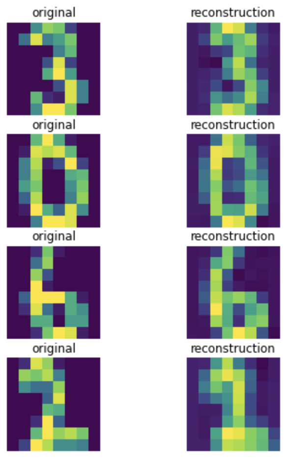
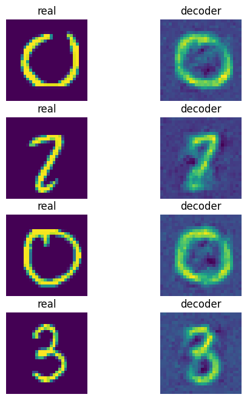

# Image_Neural_Compression

To conclude the description of the neural compressor, the whole compression procedure consists of the following steps, assuming that the model has been trained already:

1. Encode the input image,  𝐲=𝑓𝑒,𝜙(𝐱) .
2. Quantize the code,  𝐲̂ =𝑄(𝐲̂ ;𝐜) .
3. Turn the quantized code  𝐲̂   into a bitstream using  𝑝𝜆(𝐲̂ )  and, e.g., arithmetic encoding.
4. Sent the bits.
5. Decode bits into  𝐲̂   using  𝑝𝜆(𝐲̂ )  and, e.g., arithmetic decoding.
6. Decode  𝐲̂  ,  𝐱̂ =𝑓𝑑,𝜃(𝐲̂ ) .
## Data

### MNIST 8x8

### MNIST 28x28

## Result

### 64 -> 16 -> 64

*Hình 2:Thử nghiệm với ảnh kích thước 8x8 về vector 16 chiều và giải mã về kích thước 8x8.*

### 784 -> 16 -> 784

*Hình 3:Thử nghiệm với ảnh kích thước 28x28 về vector 256 chiều và giải mã về kích thước 28x28.*

## References
