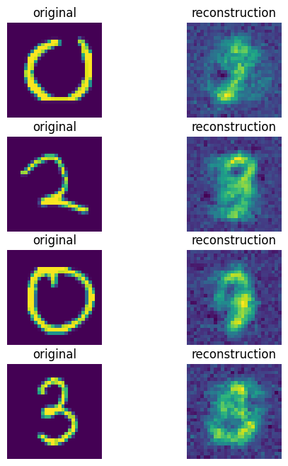

# Image_Neural_Compression

## Data

### MNIST 8x8

### MNIST 28x28

## Result

### 64 -> 16 -> 64

### 784 -> 16 -> 784
 *Hình 3:Thử nghiệm với ảnh kích thước 28x28 về vector 16 chiều và giải mã về kích thước 28x28.*
## References
